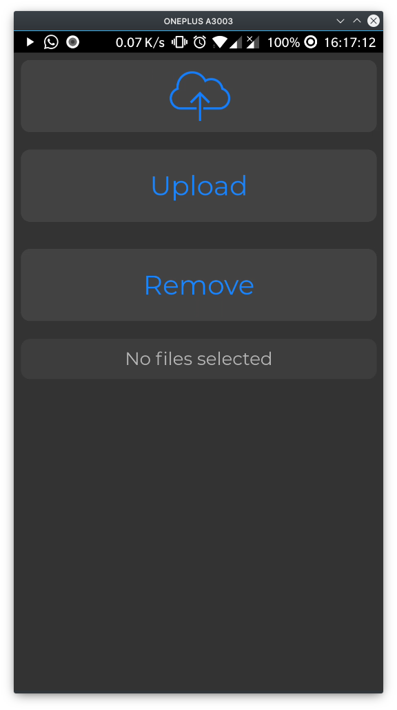
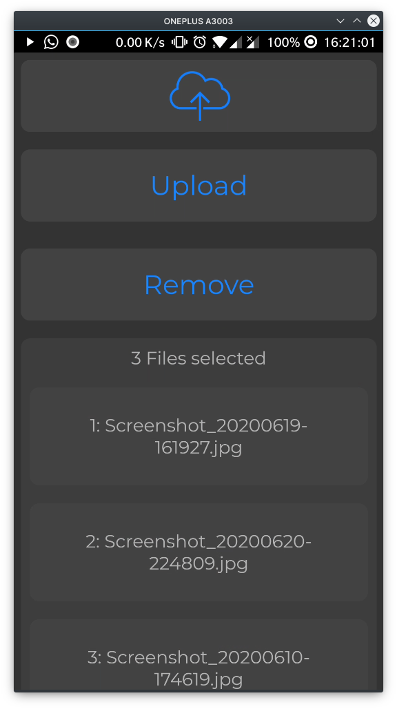
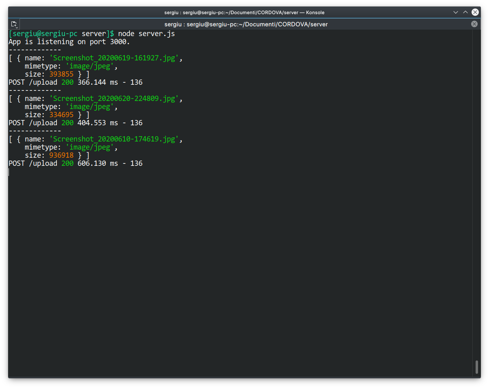
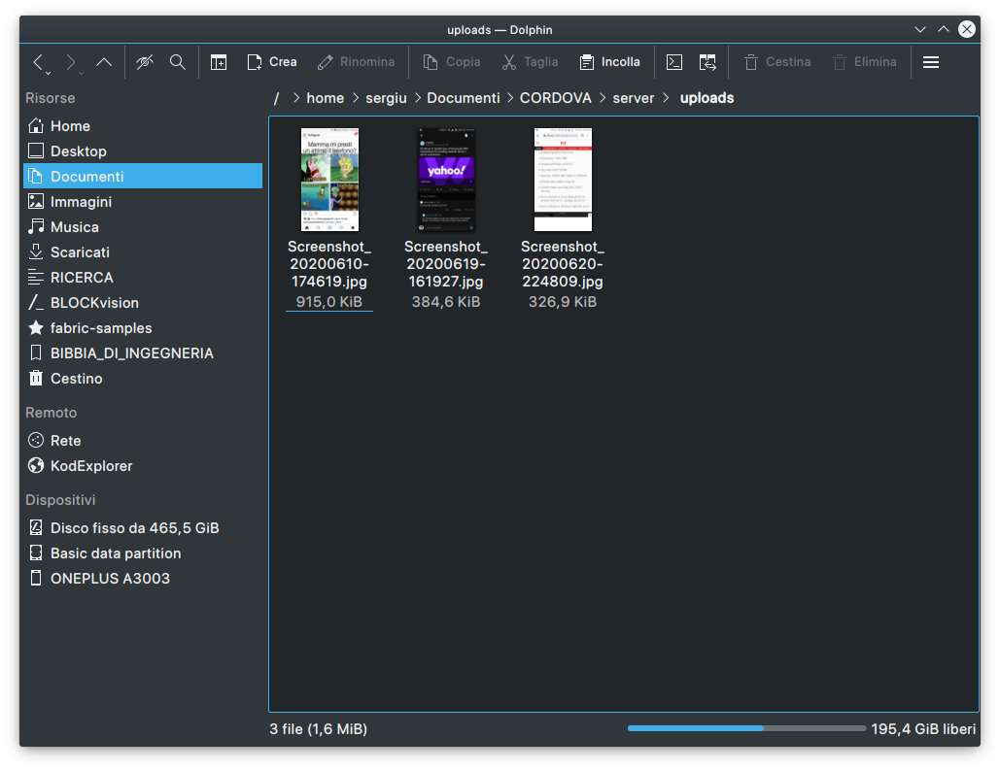

# Upload files to a server

I was working on an simple application for my Javascript class. The main purpose was to understand how to send any kind of files from client to server. For the client side I’ve used the Cordova framework and for the backend I’ve used the old good NodeJs.

In the `server`folder there is a single js file named `server.js`. First install all the dependency using `npm` or `yarn`

```bash
# go to server directory
cd ./send-files/server
# install dependency using npm if you use npm
npm install
# install dependency using yarn if you use yarn
yarn
# first discover the IP address of your pc
ifconfig
# or use ip address show 
# for example your pc have 192.168.1.117 IP address
# now start the server.js script
node server.js
# the script will automaticly create the uploads folder
# so the server will open a socket on port 3000 on 192.168.1.117
```

For the client side the situation is different, but first we need to make a small change to the `./send-files/client/www/index.html` file.

```javascript
/* 
	Change this two lines to your actual server's IP address, in this 
	way the client will talk to the server on the same socket
*/
// API server url for uploading files
URL_API_SERVER_UPLOAD = 'http://<your server IP>:3000/upload';
// API server url for removing all the files
URL_API_SERVER_REMOVE = 'http://<your server IP>:3000/remove';

// For example
URL_API_SERVER_UPLOAD = 'http://192.168.1.117:3000/upload';
URL_API_SERVER_REMOVE = 'http://192.168.1.117:3000/remove';
```

After this small change you have two choices, if you don’t want to use cordova just open the `index.html` in your browser and start sending files to your server otherwise make sure to  properly configure cordova and start to create a cordova project after the creation of the cordova project is done just replace the `www` folder and `config.xml` file  from this repository with the `www` folder and `config.xml` file from the newly created cordova project.

```bash
# make sure to have  cordova configured
# inside the repository make the cordova project
cordova create send com.example.send SendFiles
#enter in the cordova project folder
cd send
# add android platform (in my case I've used android)
cordova platform add android
# now delete the www folder and the config.xml file
rm -rv www/ config.xml
# now copy the www folder and the config.xml file from the repository to the cordova project
cp -r -t ./ ../client/www/ ../client/config.xml
# build and run the cordova app in your phone, make sure to have 
# the phone connected trough USB cable on your pc
cordova build && cordova run
```

Some images of the cordova app
<p align="center">
   
</p>

<p align="center">
    
</p>

The output of the server



The files received from the cordova app in th e`uploads` folder


